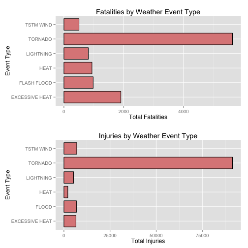
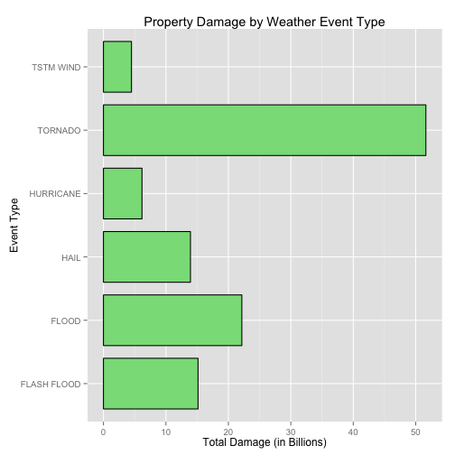

# Effects of US Storms on Public Health and Property
by William Wnekowicz


## Synopsis:
This report contains a basic analysis of the effects US storms and weather events have on public health and property. We define public health as injuries and fatalities resulting from a weather event. Impact to property is measure in dollars of property damage. We show the top 6 most impactful weather events in terms of fatal injuries, non-fatal injuries, and property damage. We also show the likelihood of an event to cause fatalities and injuries, which may inform resource-allocation decisions.


## Data Processing:


```r
library(ggplot2)
library(grid)
library(plyr)
```

### Import the dataset

```r
data <- read.csv(bzfile("repdata-data-StormData.csv.bz2"))
```

The data was obtained on March 20, 2015 from: (https://d396qusza40orc.cloudfront.net/repdata%2Fdata%2FStormData.csv.bz2)

### Top event types causing the greatest fatalities
We sum the total fatalities for each event, sort them, and choose the most fatal events.

```r
event_fatalities <- aggregate(FATALITIES ~ EVTYPE, data, FUN = sum)
sorted_fatalities <- event_fatalities[order(event_fatalities$FATALITIES, decreasing=TRUE), ]
top_fatalities <- sorted_fatalities[1:6,]
```

### Top event types causing the greatest injuries
We sum the total injuries for each event, sort them, and choose the most harmful non-fatal events.

```r
event_injuries <- aggregate(INJURIES ~ EVTYPE, data, FUN = sum)
sorted_injuries <- event_injuries[order(event_injuries$INJURIES, decreasing=TRUE), ]
top_injuries <- sorted_injuries[1:6,]
```

### Top event types causing the greatest property damage

```r
# Convert abbreviated damage numbers to fully expanded costs
replace_k <- replace(as.character(data$PROPDMGEXP), which(data$PROPDMGEXP == "K"), c("1000"))
replace_m <- replace(replace_k, which(data$PROPDMGEXP == "M"), c("1000000"))
data$FULLDMG <- data$PROPDMG * as.integer(replace_m)
```

```
## Warning: NAs introduced by coercion
```

```r
# Aggregate by event type and get most damaging events
event_damage <- aggregate(FULLDMG ~ EVTYPE, data, FUN = sum)
sorted_damage <- event_damage[order(event_damage$FULLDMG, decreasing=TRUE), ]
top_damage <- sorted_damage[1:6,]
```

### Likelihood that an event causes death or injury
We explore the likelihood that an event will cause death or injury. This is calculated as the percentage of total occurrences of a particular weather event that results in at least one death or injury.

```r
top_event_data <- subset(data, EVTYPE %in% top_fatalities$EVTYPE, select=c(BGN_DATE, INJURIES, FATALITIES, FULLDMG, EVTYPE))

top_event_data$HAS_FATALITY <- top_event_data$FATALITIES != 0
top_event_data$HAS_INJURY <- top_event_data$INJURIES != 0

damage_likelihood_fatality <- aggregate(HAS_FATALITY ~ EVTYPE, top_event_data, FUN = sum)
damage_likelihood_injury <- aggregate(HAS_INJURY ~ EVTYPE, top_event_data, FUN = sum)
damage_likelihood <- merge(damage_likelihood_fatality, damage_likelihood_injury, by="EVTYPE")
damage_likelihood <- merge(damage_likelihood, count(top_event_data, "EVTYPE"), by = "EVTYPE")

damage_likelihood$fatality_percentage <- round(damage_likelihood$HAS_FATALITY / damage_likelihood$freq * 100, 2)
damage_likelihood$injury_percentage <- round(damage_likelihood$HAS_INJURY / damage_likelihood$freq * 100, 2)
```


## Results:

### Public Health

Of the 985 weather events, the top 6 most fatal are:

```r
paste(as.character(top_fatalities$EVTYPE), collapse=", ")
```

```
## [1] "TORNADO, EXCESSIVE HEAT, FLASH FLOOD, HEAT, LIGHTNING, TSTM WIND"
```

While the top 6 most harmful non-fatal events are:

```r
paste(as.character(top_injuries$EVTYPE), collapse=", ")
```

```
## [1] "TORNADO, TSTM WIND, FLOOD, EXCESSIVE HEAT, LIGHTNING, HEAT"
```

The relative impacts of these events can be seen in the following graphs, which show the total number of fatally and non-fatally injured people by the type of weather event.


```r
p1 <- ggplot(data = top_fatalities, aes(x=EVTYPE, y=FATALITIES)) + 
  geom_bar(colour="black", fill="#DD8888", width=.8, stat="identity") +
  xlab("Event Type") + ylab("Total Fatalities") +
  ggtitle("Fatalities by Weather Event Type") +
  coord_flip()

p2 <- ggplot(data = top_injuries, aes(x=EVTYPE, y=INJURIES)) + 
  geom_bar(colour="black", fill="#DD8888", width=.8, stat="identity") +
  xlab("Event Type") + ylab("Total Injuries") +
  ggtitle("Injuries by Weather Event Type") +
  coord_flip()

pushViewport(viewport(layout = grid.layout(2, 1)))
print(p1, vp = viewport(layout.pos.row = 1, layout.pos.col = 1))
print(p2, vp = viewport(layout.pos.row = 2, layout.pos.col = 1))
```

 

Tornados result in the greatest number of fatalities and injuries. Excessive heat is a large contributor to weather-related fatalities, but comes in fourth for non-fatal injuries. 

(Note that Flash Floods in the fatalities chart are different from Floods in the injuries chart)

However, the likelihood of death or injury from any given event should be taken into account when allocating resources to its prevention. Though tornados have created the most death and injury, they've also been a highly frequent event. Only 34.39, 1.17, 23.21, 4.82, 2.64, 0.18% of Tornados result in fatalities and 9.83, 0.7, 6, 17.83, 12.7, 1.21% result in injuries. W


```r
subset(damage_likelihood, select=c(EVTYPE, fatality_percentage, injury_percentage ))
```

```
##           EVTYPE fatality_percentage injury_percentage
## 1 EXCESSIVE HEAT               34.39              9.83
## 2    FLASH FLOOD                1.17              0.70
## 3           HEAT               23.21              6.00
## 4      LIGHTNING                4.82             17.83
## 5        TORNADO                2.64             12.70
## 6      TSTM WIND                0.18              1.21
```

```r
ggplot(data = damage_likelihood, aes(x=damage_likelihood$fatality_percentage, y=damage_likelihood$injury_percentage, color=damage_likelihood$EVTYPE)) + 
  geom_point(shape=7) + 
  xlab("Likelihood of Fatalities (%)") + 
  ylab("Likelihood of Injuries (%)")
```

 


### Property

Of the 985 weather events, the top 6 most financially damaging are:

```r
paste(as.character(top_damage$EVTYPE), collapse=", ")
```

```
## [1] "TORNADO, FLOOD, FLASH FLOOD, HAIL, HURRICANE, TSTM WIND"
```

The relative impacts of these events can be seen in the following graphs, which show the total property damage by the type of weather event.


```r
ggplot(data = top_damage, aes(x=EVTYPE, y=FULLDMG/1000000000)) + 
  geom_bar(colour="black", fill="#88DD88", width=.8, stat="identity") +
  xlab("Event Type") + ylab("Total Damage (in Billions)") +
  ggtitle("Property Damage by Weather Event Type") +
  coord_flip()
```

 
